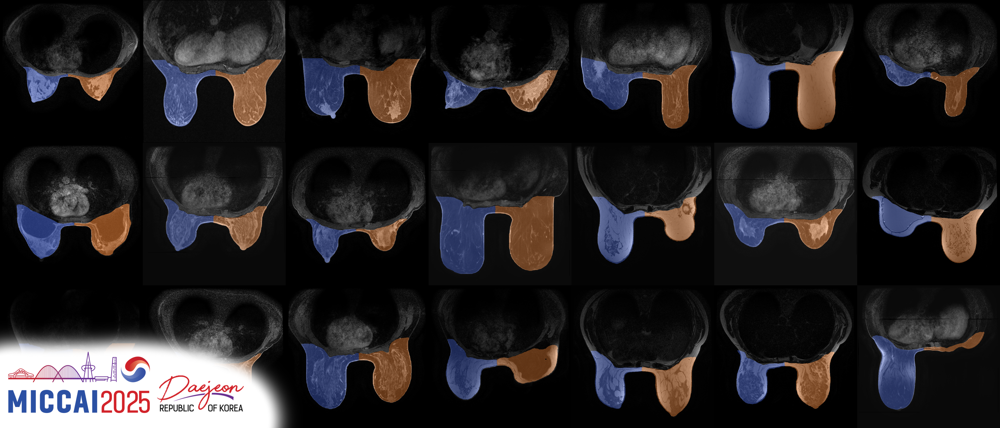

# [MICCAI 2025 WOMEN] BreastDivider: A Large-Scale Dataset and Model for Left–Right Breast MRI Segmentation

**Read the paper:**  

> **Authors**: Maximilian Rokuss\*, Benjamin Hamm\*, Yannick Kirchhoff\*, Klaus Maier-Hein  
> \*equal contribution

---

## 🧠 Introduction

**Breast MRI** plays a pivotal role in breast cancer detection, diagnosis, and treatment planning. **BreastDivider** addresses a critical limitation in breast MRI segmentation: the lack of distinction between the **left and right breasts** in most public datasets and models. 

In this work, we introduce the **first publicly available large-scale dataset with explicit left and right breast segmentation labels**, comprising **over 13,000 3D MRI scans**. Accompanying this dataset is a **robust nnU-Net–based segmentation model**, trained specifically to identify and separate left and right breast regions in clinical MRI data. This effort provides a foundation for developing high-quality, anatomically aware tools for breast MRI analysis and offers opportunities for large-scale pretraining.

---

## 📂 Dataset and Model

**BreastDivider** includes:

- 🔹 A **13.000+ cases 3D breast MRI dataset** with **left/right segmentation masks**, suitable for downstream tasks and **model pretraining**: [🤗 BreastDividerModel](https://huggingface.co/ykirchhoff/BreastDividerModel)
- 🔹 A **pretrained nnU-Net model** achieving **0.99 Dice** in 5-fold cross-validation for **robust left–right breast segmentation**: [🤗 BreastDividerDataset ](https://huggingface.co/datasets/Bubenpo/BreastDividerDataset)  
- 🔹 A ready-to-use **Docker container** for seamless deployment and inference: Coming Soon!

Stay tuned for updates! 🚀

---