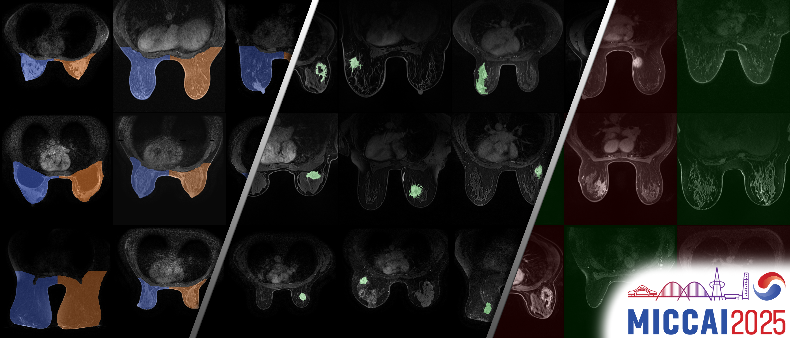

# [MICCAI 2025 WOMEN] BreastDivider: A Large-Scale Dataset and Model for Left–Right Breast MRI Segmentation

**Read the paper:**  [](https://arxiv.org/abs/2507.13830)

> **Authors**: Maximilian Rokuss*, Benjamin Hamm*, Yannick Kirchhoff*, Klaus Maier-Hein  
> *equal contribution

---

## 📰 News

- **08/25** – 📦 **Dataset V2 released** — now **17,956 cases** with **left/right** as well as partial **lesion segmentation** masks, and over **3000 lesion classification targets** 
- **08/25** – 🏆 **Used in the winning solution** of the [ODELIA Breast Cancer Classification Challenge](https://odelia2025.grand-challenge.org/)
- **07/25** – **Released BreastDivider Model and Dataset** for public use
- **07/25** – **Accepted** to **MICCAI WOMEN 2025**!   

---



---

## 🧠 Introduction

**Breast MRI** plays a pivotal role in breast cancer detection, diagnosis, and treatment planning. **BreastDivider** addresses a critical limitation in breast MRI segmentation: the lack of distinction between the **left and right breasts** in most public datasets and models.

We introduce the **first publicly available large-scale dataset with explicit left and right breast segmentation labels**, now comprising **over 17,000 3D MRI scans**. Alongside, we provide a **robust nnU-Net–based segmentation model**, trained to reliably separate left and right breast regions in clinical MRI data.  

This resource serves as a **foundation for anatomically aware AI** in breast MRI, enabling improved unilateral classification, treatment response evaluation, and post-mastectomy follow-up. It also supports large-scale **pretraining for downstream tasks**.

---

## 📂 Dataset and Model

**BreastDivider** includes:

- 🔹 **17,956 3D breast MRI scans** with **left/right segmentation masks**, curated from **7 public datasets**: Duke-Breast-Cancer-MRI, MAMA-MIA, Advanced-MRI-Breast-Lesions, EA1141, ODELIA, ISPY1, ISPY2  
- 🔹 **Lesion annotations**:  
  - **3021 lesion classification targets**  
  - **467 lesion segmentation masks**  
- 🔹 **Pretrained nnU-Net model** achieving **0.99 Dice** in 5-fold cross-validation  
- 🔹 **Docker container** for seamless deployment and inference  

📥 **Links:**  
- Dataset: [🤗 BreastDividerDataset](https://huggingface.co/datasets/Bubenpo/BreastDividerDataset)  
- Model: [🤗 BreastDividerModel](https://huggingface.co/ykirchhoff/BreastDividerModel)  
- Docker: [DockerHub](https://hub.docker.com/r/ykirchhoff/breastdivider)  

---

## 📂 Dataset Folder Structure

```text
dataset/
├── imagesTr_batch1/
├── imagesTr_batch2/
├── labelsTr_batch1/
├── labelsTr_batch2/
├── lesion_annotations/
│   ├── classification/
│   └── segmentation/
```

- **imagesTr_batch***: Training images in `.nii.gz` format (split into two batches)  
- **labelsTr_batch***: Left/right segmentation masks in `.nii.gz` format (split into two batches)  
- **lesion_annotations/classification**: `classification.csv` with lesion labels  
- **lesion_annotations/segmentation**: Lesion masks for bilateral images  

---

## 📄 Citation

If you use this dataset or model in your work, please cite:

```bibtex
@article{rokuss2025breastdivider,
  title     = {Divide and Conquer: A Large-Scale Dataset and Model for Left–Right Breast MRI Segmentation},
  author    = {Rokuss, Maximilian and Hamm, Benjamin and Kirchhoff, Yannick and Maier-Hein, Klaus},
  journal   = {arXiv preprint arXiv:2507.13830},
  year      = {2025}
}
```
